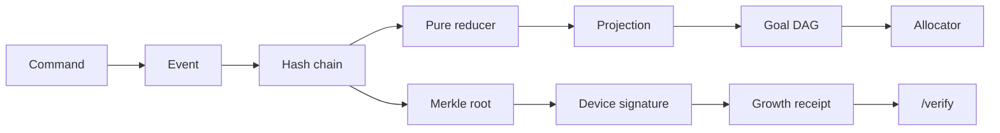

# Hypotrophy — Human Capital Engine

Local-first growth software that treats attention like capital.

Hackathon origin: **hackUMBC 2025** (Biscuit, a hamster, and a 24-hour to-do UI). This revision is the production thesis: **your history is an append-only ledger**. Completions, cuts, and dependencies are events. Events are hash-chained. Weekly commitments are Merkle roots, signed on-device. The next action is not a vibe — it is a feasible node on a DAG, ranked by Thompson sampling and half-Kelly weights.

Live mental model: *private git for who you are becoming, with a trading desk on top.*

## Why this exists

Generic habit apps are CRUD plus a chat model. Interviewers have seen a thousand of those, and they can tell. The interesting problem is different:

1. **You cannot audit a to-do list.** Anyone can edit yesterday.
2. **You cannot allocate attention.** Most apps treat every task as equal.
3. **You cannot prove the work.** A résumé bullet is a claim. A signed Merkle root over an event log is a commitment.

Hypotrophy keeps Biscuit (the companion) and replaces the data model with something you can defend for 45 minutes: event sourcing, cryptographic integrity, a constraint scheduler, and a small quant layer. It is still a personal product. The capital is *yours* — a ledger only you can extend, and a receipt other people can verify without seeing your titles.

## What to click first

```bash
npm install
npm test
npm run dev
```

Open [http://localhost:3000](http://localhost:3000), hit **Demo ledger**, then walk:

| Surface | What you are looking at |
|---|---|
| **Command** | Next best *feasible* action (DAG ∩ Thompson ∩ Kelly) |
| **Ledger** | Append-only hash chain. Tamper a payload and verification fails |
| **Graph** | Goal dependencies, generations, critical path |
| **Capital** | Half-Kelly domain weights + Kaplan–Meier survival |
| **Receipts** | Ed25519 / P-256 signed Merkle receipt (titles never included) |
| **Biscuit** | Model is an overlay, not the source of truth |
| **/verify** | Public verifier — paste a receipt JSON, no account |

## Architecture

```
UI (Next.js) ──commands──► Engine (pure TypeScript)
                               │
                               ├─ crypto/   SHA-256 chain, RFC 6962 Merkle, signatures
                               ├─ domain/   events, reducer, migration
                               ├─ graph/    cycle detect, Kahn topo, longest path
                               └─ quant/    Thompson, half-Kelly, Kaplan–Meier
```

The engine imports nothing from React. The same reducer that paints the UI is the one the tests fold. That is the interview sentence.



## Technical core (the parts that are not a wrapper)

### Hash chain
Each entry is `SHA-256(canonicalize({ seq, ts, type, payload, prevHash }))`. Canonical JSON sorts keys and **rejects floats**, because IEEE-754 is not a protocol. Mutate any historical field and `verifyChain` reports the first broken index.

### Merkle receipts (RFC 6962)
Leaves are domain-separated (`0x00 || data`), nodes too (`0x01 || left || right`). Inclusion proofs are O(log n). A receipt commits to the root plus aggregate stats — not the prose. Optional sample proofs let a verifier check specific event hashes without the rest of the log.

### Signatures
Ed25519 when the runtime supports it, ECDSA P-256 otherwise. The private key never goes to the server. `/api/receipts/verify` is stateless: it checks the signature, and if you supply leaves, recomputes the root.

Why not a public blockchain? Personal growth data is not a consensus problem. You need tamper evidence and third-party verifiability, not global replication. Using the primitives without the token is the adult version of this idea. See [TRADEOFFS.md](./TRADEOFFS.md).

### Allocator
1. **Hard constraint:** Kahn topological order. Blocked goals cannot be `next`.
2. **Critical path:** longest remaining path in the DAG (classic DP after topo).
3. **Thompson sampling:** each domain is a Beta-Bernoulli arm. Sample θ, do not just take the mean — that is how you explore a weak domain instead of starving it.
4. **Half-Kelly:** `f* = p − q/b` on Laplace-smoothed hit rate and priority-as-odds, then haircut 50% and normalize to basis points.

### Survival
Kaplan–Meier product-limit estimator on time-to-completion. Completions are events; open and abandoned goals are censored. Median survival is the first t where S(t) ≤ 0.5.

## Production surface

- Typed commands with range checks (`estimatedMinutes` ∈ [5, 1440])
- Reducer that **skips** illegal events instead of crashing the fold
- Token-bucket rate limit on AI and verify routes
- Structured JSON logs
- No API-key leakage in error bodies
- Vitest suite on the engine, including a 2048-leaf Merkle budget test
- GitHub Actions: `test`, `typecheck`, `build`
- One-way migration from the hackathon `localStorage` task list

## Resume bullets (steal these, then be ready to derive them)

- Designed a **local-first event-sourced** personal ledger with a pure reducer and hash-chained integrity, so history is auditable without a server.
- Implemented **RFC 6962 Merkle proofs** and device-local **Ed25519/P-256 receipts** that attest to a root without revealing goal titles.
- Built a **constraint + quant allocator**: DAG feasibility and critical path as hard/soft structure, Thompson sampling for exploration, half-Kelly for domain weights.
- Estimated **time-to-completion with Kaplan–Meier**, treating open goals as censored observations rather than failures.
- Hardened the AI boundary: rate limits, payload caps, and a model that annotates the ledger instead of owning it.

Talking-point script: [INTERVIEW.md](./INTERVIEW.md). Decision log: [TRADEOFFS.md](./TRADEOFFS.md). Module map: [ARCHITECTURE.md](./ARCHITECTURE.md).

## What this is not

- Not a token, not an NFT, not "AI agents managing your life."
- Not a tutorial clone. The hamster is the product personality; the engine is the claim.
- Not finished infrastructure. Persistence is localStorage; keys are extractable JWKs. Those are deliberate demo compromises, written down in TRADEOFFS so you can say what you would change on a real deploy.

## Origin

Built as Hypotrophy for hackUMBC 2025 in 24 hours: Next.js, Gemini, Biscuit. This tree keeps the character and replaces the architecture. The migration path is `hypotrophy-tasks` → `ledger.genesis` + `goal.*` events, so early users are not discarded.
